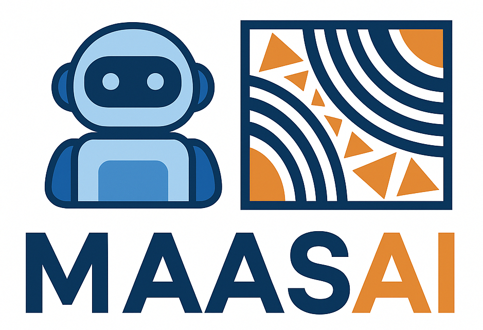

<p align="left">
  
</p>

# Multi-Agent AI System for Astrodata Inference

This project organizes the MAASAI workflow as a modular LangGraph application.

## Structure

- `maasai/config.py` - environment-backed settings
- `maasai/state.py` - shared graph state
- `maasai/schemas.py` - structured contracts
- `maasai/model_router.py` - LiteLLM alias selector
- `maasai/agents.py` - LangChain agents
- `maasai/guardrails.py` - lightweight early checks
- `maasai/rag.py` - prompt-optimization retrieval stub
- `maasai/tools.py` - astronomy REST/MCP tool stubs
- `maasai/nodes.py` - graph node functions
- `maasai/graph.py` - graph topology
- `scripts/run.py` - runnable entry point
- `config/litellm_config_template.yaml` - LiteLLM Proxy config with an upstream pool on port 8000

## Install

```bash
python -m venv .venv
source .venv/bin/activate
pip install -r requirements.txt
```

## Run LiteLLM Proxy
For testing the LiteLLM proxy run:

```bash
litellm --config litellm_config.yaml
```

## Run the app

```bash
python scripts/run.py --config=litellm_config.yaml [OPTIONS]   
```

## Notes

- The Python app only chooses the logical aliases `model-tiny`, `model-small`, `model-medium`, `model-large`, `model-commercial-mini`, and `model-commercial`.
- LiteLLM Proxy performs the actual load balancing across the remote OLLAMA/ChatGPT endpoints.
- Replace the placeholder endpoint IPs with your real servers.
- Replace the RAG stub and tool stubs with your production integrations.
